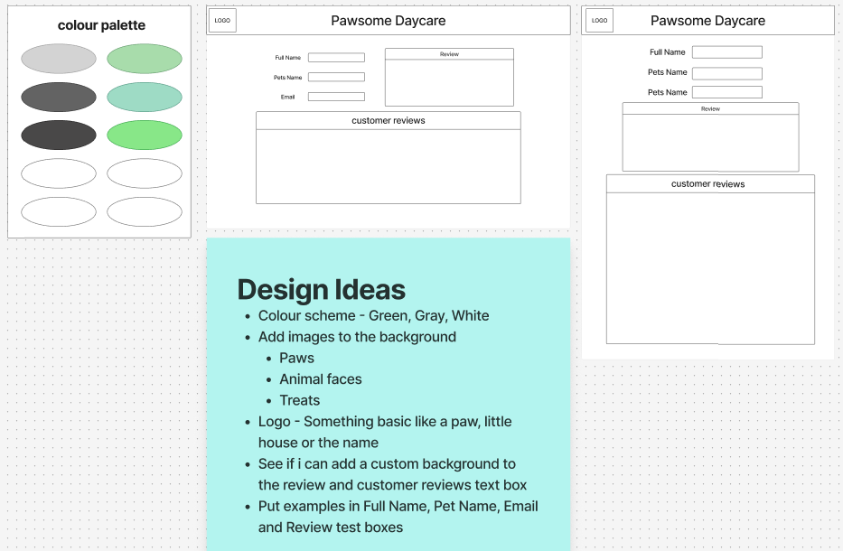

# Reflection

This week, we've been learning about clients and servers and, most importantly, how to get them to communicate with each other. For this week's assignment, we'll be making a Guestbook, like the ones in hotels, for users to leave a review for other users to see. With this week's assignment, I thought I was going to be a little behind as I missed half a day and did most of the lessons from home this week, but I seem to be doing better than I thought I would be.

It's definitely a different experience building a full-stack app compared to what we have been doing in previous assignments, as there is so much more you've got to take into consideration. One thing that got me was working with multiple JavaScript files. With this assignment, it feels like we are taking everything we did in weeks 1, 2, and 3's assignments and putting it into one, which is pretty cool to see everything we have learned go together.

If there is anything you think I could do better or improve on, I'd be happy to listen and learn from what you have to say.

# Requirements

- ✅ 🎯 Ensure your HTML form is working and submitting data into the database as expected.
  - I've made sure that my review page works on Render. It submits a new review and displays it
- ✅ 🎯 Confirm that your project is functional on multiple screen sizes using either Responsive Design or media queries.
  - I used @media so that my review page looks presentable on both desktop and mobile
- ✅ 🎯 Create a working GET API route in your server.
- ✅ 🎯 Create a working POST API route in your client.
  - You can find my GET and POST API routes within my server.js file
- ✅ 🎯 Seed your database with realistic-looking ‘dummy’ data through the Supabase query editor or a seed file in your server. Ensure that this is saved and submitted (in a screenshot or seed file form) so it can be marked and tested efficiently.
  - I've added a screenshot of my schema visualizer in the image folder. I've copied and pasted my SQL from Supabase into a queries.sql file and also put some test reviews into a seed.js file

# Stretch Requirements

- ✅ 🏹 Style the page excellently, for example, by adding extra UX considerations or animations.
  - I feel like I have achieved this as I've gone for a simple and clean design, made everything flow nicely together, I've kept my colour palette to just 3 throughout my site, I've added white borders to help break certain elements up
- ✅ 🏹 Provide additional functionality on the form, for example, by adding form validation or other options.
  - I have added placeholder text in each box to help users know what to put in the boxes and I've made the review box have a maximum characters of 300

# requirements that I wasn't able to achieve

- ❌ 🏹 Add a delete button to each message and a DELETE route in the server.
- ❌ 🏹 Create an option for users to like others’ posts.
  - I've started on these two stretch goals. I've added a button for both and styled them. I've just got to do the JavaScript to make them actually work

# Wireframe

The provided wireframe outlines the desktop and mobile layouts for a customer review page. Its primary purpose is to create a seamless user experience for pet owners who want to share their feedback. Both versions feature a dedicated form for users to submit new reviews and a prominent section to display existing customer reviews. This dual functionality ensures that visitors can easily contribute their own stories while also seeing positive feedback from other clients, building trust and credibility for the business.

The layout is designed to be clean ensuring that pet owners can navigate the page effortlessly on any device. The desktop version provides a spacious layout for the review form and a clear view of multiple customer reviews, while the mobile version is optimized for smaller screens, making it quick and simple for users on the go to share their experiences.

<div align="center">



</div>

# Errors or Bugs I Encountered

- I encountered an error while attempting to deploy my repo on Render within the Web Service stage. The issue was traced to the line `import { db } from "./dbConnection.js";` in my server.js file. This line was causing an import error because it was not used, which in turn caused the Render deployment to fail. I have now updated my [step-by-step](https://github.com/IndieMasco/TechEdSoftwareDeveloper021/blob/main/week4/render-and-supabase/READme.md) guide so that other people don't run into the same issue
- Working on two different PCs, I sometimes forget to pull when I first start, and then once I go to push, I get errors because I'm trying to push and pull at the same time. I've then got to try and figure out how to merge them both. If this step could be explained to me, that would be very helpful.
- Once I had met all the basic goals, I was going through everything and making sure it all worked. When I loaded my site on Render, it wasn't pulling my table. At first, I thought it was because I still had my localhost link within my app.js file, so I changed that, and it still wasn't pulling it. It turned out I hadn't added my transaction pooler link into the environment variables on Render. I want to give a shout-out to Will for sitting in chat with me and helping to resolve this issue

# What went really well and what could have gone better?

- I was struggling to get everything talking with each other. It took me about 15 minutes to realize we are working with multiple JavaScript files for this assignment, and I hadn't done anything with my app.js on the client side. 😅
- I've got everything talking to each other, and my site is displaying the reviews. I just can't seem to figure out how to make the page refresh when I click Submit, so the form boxes clear and the new review displays. It's time to go down some rabbit holes to see if I can get it working. 🤞 I DID IT, WOOOOOOO! THE PAGE REFRESHES ON SUBMIT 🎉
- I don't know if it has something to do with how I write my code, or if it's just normal, but when I load my review page on the Render link, it takes a little while to display the reviews
- On my page, I wanted the reviews to show the newest at the top, descending to the oldest. This was the way I managed to get it done, but I would like to know if there is a better way

```javascript
app.get("/PawsomeDaycare", async function (req, res) {
  const query = await db.query(`SELECT * FROM pawsomedaycare ORDER BY id DESC`);
  res.json(query.rows);
});
```

# External sources

- Manny asked that we make sure we add the links we used, so I made sure to add all the links I used 😅

### Info

[My own repo](https://github.com/IndieMasco/TechEdSoftwareDeveloper021) , [Tech Ed repo](https://github.com/Tech-Educators/software-dev-021) , [FigJam](https://www.figma.com/board/JjN2Zgtoynrau06MjWJs6q/SD021?node-id=0-1&p=f&t=V1WCGcrmVKnoxJDr-0) , [MDN](https://developer.mozilla.org/en-US/) , [W3School](https://www.w3schools.com/)

### Render & Supabase

[My own READme](https://github.com/IndieMasco/TechEdSoftwareDeveloper021/blob/main/week4/render-and-supabase/READme.md)

### Form

[Simple Contact Form](https://www.youtube.com/watch?v=lU98TelrlPM&t=175s) , [HTML forms](https://www.youtube.com/watch?v=zIN54lhJtQU) , [W3School - Forms](https://www.w3schools.com/html/html_forms.asp) , [MDN Forms](https://developer.mozilla.org/en-US/docs/Learn_web_development/Extensions/Forms/Your_first_form)

### Fetch

[API & Display in HTML](https://www.youtube.com/watch?v=zUcc4vW-jsI) , [Fetch API using JavaScript](https://www.youtube.com/watch?v=37vxWr0WgQk)

### Styling

[CSS Cheat sheet](https://htmlcheatsheet.com/css/) , [W3School - hover effect](https://www.w3schools.com/howto/howto_css_animate_buttons.asp) , [CSS hover effect](https://prismic.io/blog/css-hover-effects) , [Google fonts](https://fonts.google.com/)

### Refresh on submit

[Stack overflow - Refresh](https://stackoverflow.com/questions/18920651/how-can-i-refresh-a-form-page-after-the-form-submits-to-blank) , [automatically refresh](https://www.youtube.com/watch?v=IPT3BKoM2Pc) , [MDN - Location: reload() method](https://developer.mozilla.org/en-US/docs/Web/API/Location/reload) , [W3School - if, else, and else if](https://www.w3schools.com/js/js_if_else.asp) , [MDN - if...else](https://developer.mozilla.org/en-US/docs/Web/JavaScript/Reference/Statements/if...else) , [MDN - Promise.prototype.then()](https://developer.mozilla.org/en-US/docs/Web/JavaScript/Reference/Global_Objects/Promise/then) , [Stack overflow - then()](https://stackoverflow.com/questions/3884281/what-does-the-function-then-mean-in-javascript)

### Like button

[Add a Like or Dislike Button](https://www.youtube.com/watch?app=desktop&v=20tJJAI6_oA) , [Stack overflow - Dislike button](https://stackoverflow.com/questions/4298300/how-to-implement-the-dislike-like-button)
